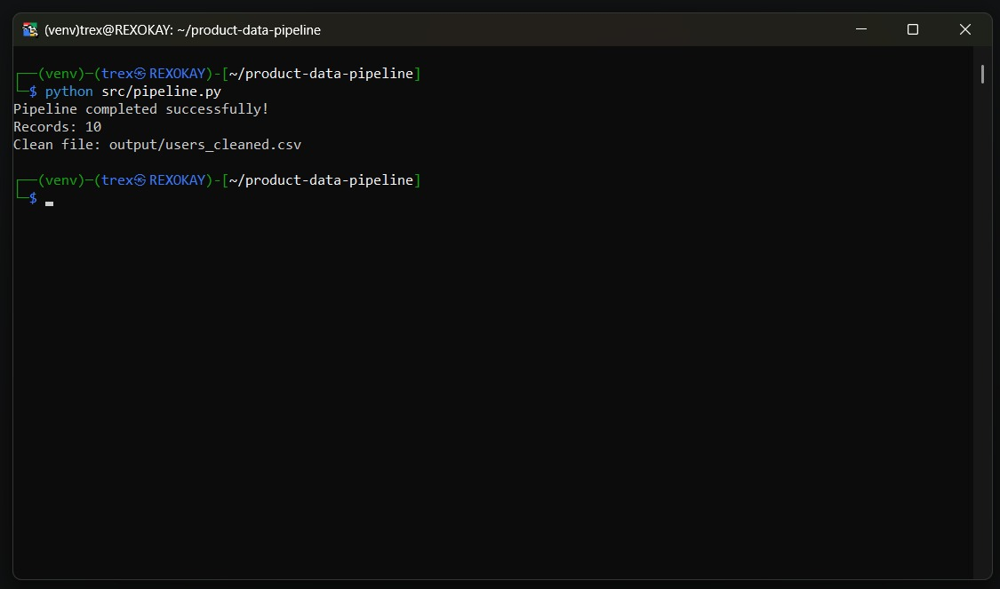
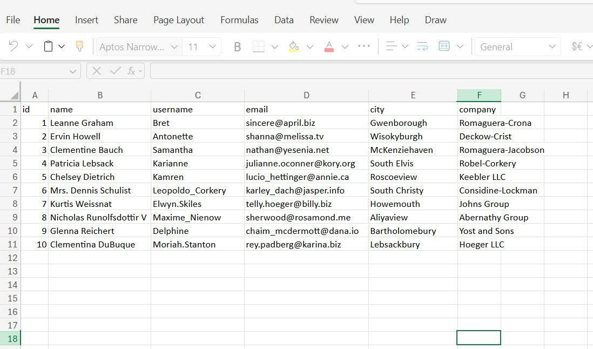
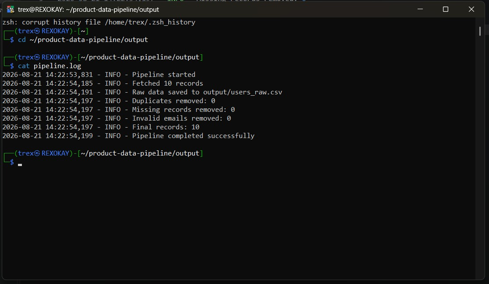

# Product Data Pipeline

A Python data-cleaning pipeline that fetches user data from an API, cleans and validates it, and saves raw and cleaned datasets as CSV files.

## Features

- Fetches user data from a public API
- Saves the original raw dataset
- Removes duplicate records
- Removes records with missing names or emails
- Standardizes text fields and email addresses
- Validates email formats
- Creates a log file with pipeline activity and record counts
- Saves cleaned data as a CSV file

## Project Structure

```text
product-data-pipeline/
├── config.py
├── pipeline.py
├── requirements.txt
├── README.md
├── output/
│   ├── users_raw.csv
│   ├── users_cleaned.csv
│   └── pipeline.log
└── screenshots/
```

## Installation

```bash
pip install -r requirements.txt
```

## Run the Pipeline

```bash
python pipeline.py
```

## Output

The pipeline creates these files in the `output` folder:

- `users_raw.csv` — original API data
- `users_cleaned.csv` — cleaned and validated data
- `pipeline.log` — execution logs, including fetched and cleaned record counts

## Technologies Used

- Python
- Pandas
- Requests
- Logging

## Screenshots

### Pipeline Execution



### Cleaned Dataset



### Pipeline Logs

